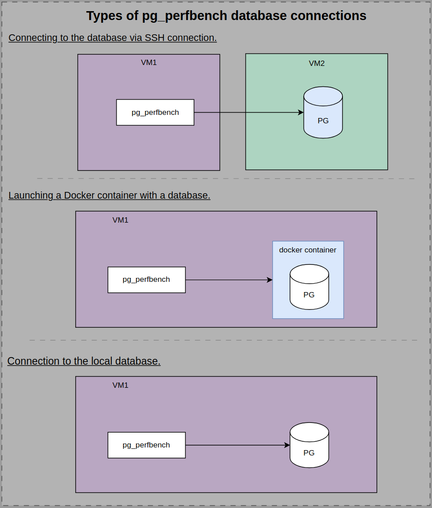

# PostgreSQL Performance Bench
This application serves as a wrapper around pgbench and performs the following tasks:

- Launches the pgbench workload;
- Collects system information:
     - CPU;
     - RAM; 
     - The rest of the information is specified in the application configuration.
    
  and database information:
    - version;
    - DB settings;
    - The rest of the information is specified in the application configuration.
- Generates a report summarizing database performance, configuration, and the server environment.

# Table of Contents
- [Dependencies and installation](#dependencies-and-installation)
- [Configuring options](#configuring-options)
     - [`benchmark` mode](#benchmark-mode)
     - [`collect info` mode](#collect-info-mode)
     - [`join` mode](#configuring-pg_perfbench-in-join-mode)
- [Configuring report](#configuring-report)
- [Running tests](#running-tests)

## Dependencies and installation
- OS: Ubuntu 22.04
- Pre-installed PostgreSQL client applications: `psql`, `pgbench`. For example, using:
```
sudo apt install postgresql-client
sudo apt install postgresql-contrib
 ```
- Python 3.10+ and pip3:

- Create a Python virtual environment in the project's root directory for ease of use:
```
cd pg_perfbench
python3.10 -m venv venv
source venv/bin/activate
```
- Install additional packages for Python, for example, using:
 ```
  pip install -r requirements.txt
 ```
- For the tool to work, the database must be accessible under the user postgres or another
specified user with SUPERUSER rights
- Before running the tests, install and configure Docker access for the user who will be running the tool:
```
sudo apt-get install docker
sudo apt-get install docker.io
chmod 666 /var/run/docker.sock
```
- To ensure successful use, first thoroughly explore the capabilities of the tool and run the tests.

# Configuring options
**pg_perfbench** supports three modes: `benchmark`, `collect info` and `join`.
A report is generated for all modes.
- In `benchmark` mode, the application loads the
configured database instance and сollects information about the server environment and database configuration .<br>
- In `collect info` mode, the application сollects information about the server environment and database configuration.<br>
- In `join` mode, the application compares reports with each other.
# Configuring pg_perfbench in `benchmark` and `collect info` mode

## Service options
| Parameter      | Description                                                                                                                                             |
|----------------|---------------------------------------------------------------------------------------------------------------------------------------------------------|
| `--help`, `-h` | Lists all the available options or flags that can be used with the command, <br> along with a short description of what each option does and after which exit occurs.|
| `--log-level`  | Application logging level: `info`, `debug`, `error`.<br/>Default - `info`                                                                               |
| `--clear-logs` | Clearing logs from the tool's previous session. <br>Logs are located in the 'logs' folder of the root directory.                                        |
## Connection options
 
> **Note**: Port forwarding to the target database occurs, so make sure to use an available local forwarding port for --pg-port (default value is 5432).

### Common parameters

| Parameter           | Description                                                      |
|---------------------|------------------------------------------------------------------|
| `--connection-type`        | Connection types: `ssh`, `docker`, `local`                            |

### General instructions for all connection types
 - Bash scripts are used to collect system information, and the commands within them must be available for execution 
by the application's user, for example:
<br>&nbsp;&nbsp;To allow the `postgres` user to execute `lshw` without a password, add the following privileges:

```bash
# ========================================
# Actions on the data base host
# ========================================
sudo visudo
>>>
postgres ALL=(root) NOPASSWD: /usr/bin/lshw
```
- Ensure that the postgres user has the privilege to clear the file 
system cache on the database server. Execute the following command on the `database` host:

```
# ========================================
# Actions on the data base host
# ========================================
echo ' $(whoami) ALL=(ALL) NOPASSWD: /bin/sh -c echo 3 | /usr/bin/tee /proc/sys/vm/drop_caches' | sudo EDITOR='tee -a' visudo -f /etc/sudoers
```


### SSH connection

| Parameter           | Description                                                      |
|---------------------|------------------------------------------------------------------|
| `--ssh-port`        | Port for ssh connection (default: 22)                            |
| `--ssh-host`        | IP address of the remote server                                  |
| `--ssh-key`         | Path to the ssh connection private key file (must be configured) |
| `--remote-pg-host`  | Host of the remote server's database (default: 127.0.0.1)        |
| `--remote-pg-port`  | Port of the remote server's database (default: 5432)             |

#### Environment preparation
* During the operation of pg_perfbench, it is necessary to set local environment variables within the session connecting
to the database host. When establishing an SSH connection, you must first update the AcceptEnv parameter in the SSH
configuration file (/etc/ssh/sshd_config) on the database server. Specify the argument pattern as 'ARG_*' to allow 
multiple variables to be passed in:
<br>`/etc/ssh/sshd_config:` <br>
```
...
# Allow client to pass locale environment variables
AcceptEnv LANG LC_* ARG_*
...
```
* To archive the instance logs, install tar(Ubuntu example) on the data base server:
```
sudo apt update
sudo apt install tar
```
* `The SSH connection user is postgres`. Configure SSH access keys on the database server to establish a connection to the postgres user:

```
# ========================================
# Actions on the pg_perfbench host
# ========================================

# create an ssh key at the path you specify 
mkdir -p path/to/your/postgres_keys/.ssh
ssh-keygen -t rsa -b 4096 -C "postgres" -f postgres_keys/.ssh/id_rsa
 
ls postgres_keys/.ssh
>>
    id_rsa  id_rsa.pub
 
 
chmod 700 postgres_keys/.ssh
chmod 644 postgres_keys/.ssh/id_rsa.pub
chmod 600 postgres_keys/.ssh/id_rsa 
 
scp postgres_keys/.ssh/id_rsa.pub <user>@<database_server_address>:/tmp
# ========================================
# Actions on the data base server
# ========================================
cat >> /etc/ssh/sshd_config << EOL
PubkeyAcceptedKeyTypes=+ssh-rsa
EOL
systemctl restart sshd
 
mkdir /var/lib/postgresql/.ssh
cat /tmp/id_rsa.pub >> /var/lib/postgresql/.ssh/authorized_keys
chmod 700 /var/lib/postgresql/.ssh
chown -R postgres:postgres /var/lib/postgresql/.ssh

```
see more details on benchmark configuration over an SSH connection [here](doc/ssh_mode_usage.md).

### Local connection

For establishing a local connection to the database, you need to set the connection type:
```
--connection-type=local
```

When using a local connection, the application must be configured in the postgres user's environment.
```
su - postgres 
git clone https://github.com/TantorLabs/pg_perfbench.git
cd pg_perfbench
```
For more details on configuring the local database load, see [here](doc/local_mode_usage.md).

### Docker connection
Preconfigure access to Docker for the user who is running the tool.

| Parameter          | Description                                             |
|--------------------|---------------------------------------------------------|
| `--container-name` | Name of creating container                              | 

see more details on benchmark configuration for a database in a Docker container [here](doc/docker_mode_usage.md).

### PostgreSQL database options:
The flags `pg_host` and `pg_port` are optional parameters for forwarding the address and port 
from the current host to the database host, `used directly by the tool`.

| Parameter         | Description                                                          |
|-------------------|----------------------------------------------------------------------|
| `--pg-port`       | Forwarded port (default `5432`, relative to the current host)        |
| `--pg-host`       | Forwarded address (default `127.0.0.1`, relative to the current host) |
| `--pg-user`       | User of database (must be configured or set "postgres")              |
| `--pg-database`   | Database used for testing                                            |
| `--pg-user-password` | Password for database connection (optional)                          |
| `--pg-data-path`  | Path to the PostgreSQL data directory (relative to the database host) |
| `--pg-bin-path`   | Path to the PostgreSQL bin directory (relative to the database host) |
| `--collect-pg-logs` | Enable database logging (logging must be configured by the user)     |
| `--custom-config`  | Use custom PostgreSQL config                                         |

### Configuring report options:
| Parameter            | Description                                                                |
|----------------------|----------------------------------------------------------------------------|
| `--report-name`   | Report name and chart time series                                  |

## `benchmark` mode
### Workload, report options

#### Workload options:
| Parameter            | Description                                                                |
|----------------------|----------------------------------------------------------------------------|
| `--benchmark-type`   | The benchmark to use: `default`, `custom`                                  | 
| `--workload-path`    | Path to the load scripts directory                                         |
| `--pgbench-clients`  | pgbench benchmarking arguments: --clients, is set as an array (e.g. 1,2,3) |
| `--pgbench-time`     | pgbench benchmarking arguments: --time, is set as an array (e.g. 1,2,3)    |
| `--pgbench-path`     | Specify the pgbench path (relative to the current host)                    |
| `--psql-path`        | Specify the psql path (relative to the current host)                       |
| `--init-command`     | Terminal command to create a table schema (relative to the current host)   |
| `--workload-command` | Terminal command for loading the database (relative to the current host)   |

#### Configuring report options:
`--pgbench-time` - `pgbench` benchmarking arguments; The report [diagram](doc/logic_building_and_comparing_reports.md#Generating-report-in-`benchmark`-mode) will display tps/clients;
<br> `--pgbench-clients` - `pgbench` benchmarking arguments; The report [diagram](doc/logic_building_and_comparing_reports.md#Generating-report-in-`benchmark`-mode) will display tps/time                    

<br> 

- Use placeholders to set values in the table schema and load testing commands:
configure placeholders like `'ARG_'+ <DB/Workload options>`.<br><br>  
For example, you can configure pgbench by specifying the path of the load files 
(this example describes the full set of arguments for ssh connection):
```
python -m pg_perfbench --mode=benchmark \
--collect-pg-logs \
--report-name=ssh-pg-custom-benchmark   \
--custom-config=/tmp/user_postgresql.conf \
--log-level=debug \
--ssh-port=22 \
--ssh-key=path/to/private_key \
--ssh-host=10.128.0.141 \
--remote-pg-host=127.0.0.1 \
--remote-pg-port=5432 \
--pg-host=127.0.0.1 \
--pg-port=5435 \
--pg-user=postgres \
--pg-user-password=test_user_password \
--pg-database=tdb \
--pg-data-path=/var/lib/postgresql/data \
--pg-bin-path=/usr/lib/postgresql/15/bin \
--benchmark-type=custom \
--pgbench-clients=5,10,50 \
--workload-path=/path/to/workload \
--pgbench-path=/usr/bin/pgbench \
--psql-path=/usr/bin/psql \
--init-command="cd ARG_WORKLOAD_PATH && ARG_PSQL_PATH -p ARG_PG_PORT -h ARG_PG_HOST -U postgres ARG_PG_DATABASE -f ARG_WORKLOAD_PATH/table-schema.sql" \
--workload-command="ARG_PGBENCH_PATH -p ARG_PG_PORT -h ARG_PG_HOST -U ARG_PG_USER --no-vacuum --file=ARG_WORKLOAD_PATH/custom_script_1.sql --file=ARG_WORKLOAD_PATH/custom_script_2.sql ARG_PG_DATABASE -c ARG_PGBENCH_CLIENTS -j 20 -T 10"
```


or standard pgbench load
(this example shows all arguments needed to load a database in a Docker container):
```
python -m pg_perfbench --mode=benchmark \
--log-level=debug \
--report-name=docker-pg-default-benchmark \
--collect-pg-logs \
--custom-config=/tmp/user_postgresql.conf \
--container-name=cntr_expected \
--pg-host=127.0.0.1 \
--pg-port=5435 \
--pg-user=postgres \
--pg-user-password=test_user_password \
--pg-database=tdb \
--pg-data-path=/var/lib/postgresql/tantor-se-1c-15/data \
--pg-bin-path=/opt/tantor/db/15/bin \
--benchmark-type=default \
--pgbench-time=600,1200 \
--init-command="ARG_PGBENCH_PATH -i --scale=100 --foreign-keys -p ARG_PG_PORT ARG_PG_HOST -U postgres ARG_PG_DATABASE" \
--workload-command="ARG_PGBENCH_PATH -p ARG_PG_PORT -h ARG_PG_HOST -U ARG_PG_USER ARG_PG_DATABASE -c 5 -j 5 -T ARG_PGBENCH_TIME --no-vacuum"

```

See more details about workload configuration [here](doc/workload_description.md).

**Example benchmark report** - [benchmark-report.html](examples/benchmark/benchmark-docker-default.html)

## `collect info` mode
The mode of information collection is described [here](doc/logic_building_and_comparing_reports.md).

Collection of remote server system information via an SSH connection:
```
python -m pg_perfbench --mode=collect-sys-info \
--report-name=benchmark-ssh-default-2 \
--log-level=debug \
--connection-type=ssh \
--ssh-port=22 \
--ssh-key=/tmp/private_key \
--ssh-host=10.177.143.88
```
Collection of all database information in a Docker container:
```
python -m pg_perfbench --mode=collect-db-info   \
--report-name=test-collect-db-info-docker-container \
--log-level=debug   \
--container-name=cntr_result    \
--pg-host=127.0.0.1 \
--pg-port=5435  \
--pg-user=postgres  \
--pg-database=tdb   \
--pg-data-path=/var/lib/postgresql/data \
--pg-bin-path=/usr/lib/postgresql/15/bin
```
Collection of all information from the remote database server via an SSH connection:
```
python -m pg_perfbench --mode=collect-all-info  \
--report-name=all-info-report   \
--log-level=debug   \
--connection-type=ssh   \
--ssh-port=22   \
--ssh-key=/tmp/private_key  \
--ssh-host=10.177.143.88    \
--remote-pg-host=127.0.0.1  \
--remote-pg-port=5432   \
--pg-host=127.0.0.1 \
--pg-port=5435  \
--pg-user=postgres  \
--pg-database=tdb   \
--pg-data-path=/var/lib/postgresql/16/main  \
--pg-bin-path=/usr/lib/postgresql/16/bin
```

Examples of information collection reports - [collect-all-info-docker.html](examples/collect_info/collect-all-info-docker.html) 
# Configuring pg_perfbench in `join` mode

| Parameter           | Description                                                                                                                                                    |
|---------------------|----------------------------------------------------------------------------------------------------------------------------------------------------------------|
| `--report-name`   | Report name                                                                                                                                 |
| `--join-task`       | A JSON file containing a set of merge criteria,which are items of sections,<br/> should be located in join_tasks at the root of the project                    |
| `--input-dir`       | Directory with reports on the load of a single database instance, files with <br/>a 'join' prefix are ignored. The default directory set is 'report'           |
| `--reference-report`| The report specified as a benchmark for comparison with other reports. By default, the first report listed alphabetically in the --input-dir path is selected  |

Template for the comparison criteria file:
```
{
        "description": "Comparison of database performance across different configurations in the same environment using the same PostgreSQL version",
        "items": [
            "sections.<section_name_of_report_struct>.reports.<report_name>.data",
            ....
            "sections.system.reports.uname_a.data",
        ]
}
```
Example of argument configuration in join mode:
```
python -m pg_perfbench --mode=join \
--join-task=task_compare_dbs_on_single_host.json \
--reference-report=benchmark_report.json \
--input-dir=/path/to/some/reports
```

Examples of join report - [join_report.html .](examples/join/join_report.html)
# Configuring report
See more details about report configuration [here](doc/logic_building_and_comparing_reports.md).

You can configure the JSON report template file from `pg_perfbench/reports/templates`.
Add or remove reports of the following types:

- "shell_command_file" - a report with the result of executing the specified bash script relative to the database host in the `pg_perfbench/commands/bash_commands` directory, for example:
```
"example_bash_report": {
  "header": "example_bash_header",
  "state": "collapsed",
  "item_type": "plain_text",
  "shell_command_file": "bash_example.sh",
  "data": ""
}
```
It is necessary to first ensure that the script executes correctly  for the utility's user.


- "sql_command_file" - a report with the result of executing the specified SQL script in the database located in the `pg_perfbench/commands/sql_commands` directory, for example:
```
"example_sql_report": {
    "header": "example_sql_header",
    "state": "collapsed",
    "item_type": <"plain_text", "table">,
    "sql_command_file": "sql_example.sql",
    "data": ""
}
```
# Running tests
When testing the tool, a Docker connection is used. Preconfigure access to Docker for the user who is running the tool.
- specify the `user` from which the tool is run:
```
echo ' <pg_perfbench user> ALL=(ALL) NOPASSWD: /bin/sh -c echo 3 | /usr/bin/tee /proc/sys/vm/drop_caches' | sudo EDITOR='tee -a' visudo -f /etc/sudoers
```
- set PYTHONPATH variable:
```
cd pg_perfbench
>>
pg_perfbench  requirements_dev.txt  tests
LICENSE log README.md requirements.txt

export PYTHONPATH=$(pwd)
```
- single test running. Example of executing unit tests:
```
python -m unittest tests.context.test_docker_connection_context -v --failfast
```
- executing all tests: 
<br>`python -m unittest discover tests`
###
###
