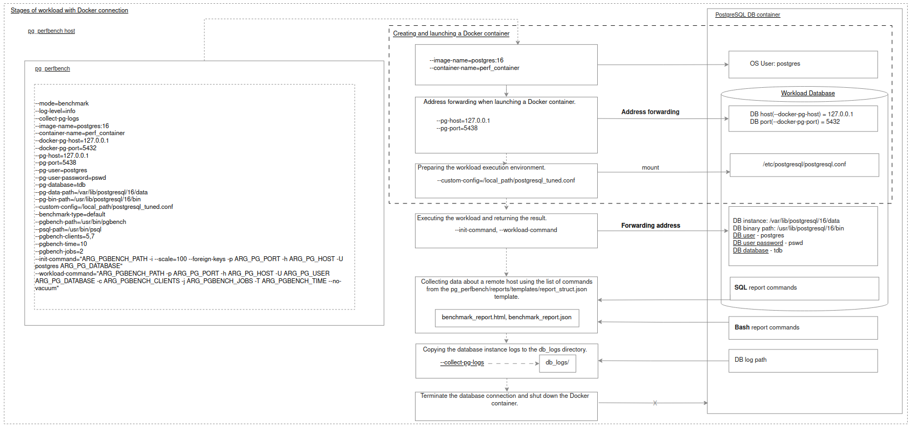

# PostgreSQL Performance Bench
## Testing a PostgreSQL database instance located in a Docker container

#### General environment preparation 

Review and follow the steps outlined in the README [Prerequisites](../README.md#prerequisites).

### Simple testing configuration using the Postgres image from DockerHub
#### Environment preparation 

Download the postgres docker image, for example postgres:16
```
docker pull postgres:16
```
#### Configuration of pg_perfbench parameters and execution

- `pg_perfbench`  is executed as a module:
```
python -m pg_perfbench <args>
```

- Application operating mode {benchmark, join}:
```
--mode=benchmark
```

- Сonfigure docker container usage parameters:
```
--container-name=test_container
--pg-host=127.0.0.1
--pg-port=5438
```
> **Note**: `--pg-port, --pg-host` - Local address parameters used for forwarding to the database instance's listening address in the container `--docker-pg-port, --docker-pg-host`. The specified address `--pg-port, --pg-host` should be available for `pg_perfbench`.

 
- Logging level for output of application execution stages {info,debug,error}:
```
--log-level=debug
```
- Database instance parameters:
```
--pg-user=postgres
--pg-user-password=pswd
--pg-database=tdb
--pg-data-path=/var/lib/postgresql/data
--pg-bin-path=/usr/lib/postgresql/16/bin
```

- pgbench workload environment parameters:
```
--benchmark-type=default
--psql-path=/usr/bin/psql
--pgbench-path=/usr/bin/pgbench
--init-command="ARG_PGBENCH_PATH -i --scale=100 --foreign-keys -p ARG_PG_PORT -h ARG_PG_HOST -U postgres ARG_PG_DATABASE"
--workload-command="ARG_PGBENCH_PATH -p ARG_PG_PORT -h ARG_PG_HOST -U ARG_PG_USER ARG_PG_DATABASE -c ARG_PGBENCH_CLIENTS -j 3 -T 10 --no-vacuum"
```
- You can also specify arguments used as placeholders in command strings `--init-command`,  `--workload-command` (see more [workload description](workload_description.md#how-to-configure-workload)):
  - `--pg-host` will be resolved as `ARG_PG_HOST`.
  - `--pgbench-time` will be resolved as `ARG_PGBENCH_TIME`.

- Final set of arguments for database workload in the Docker container:
```
python -m pg_perfbench --mode=benchmark    \
--log-level=debug   \
--collect-pg-logs   \
--container-name=test_container  \
--pg-host=127.0.0.1 \
--pg-port=5438  \
--pg-user=postgres  \
--pg-user-password=pswd \
--pg-database=tdb   \
--pg-data-path=/var/lib/postgresql/data \
--pg-bin-path=/usr/lib/postgresql/16/bin    \
--pgbench-path=/usr/bin/pgbench \
--psql-path=/usr/bin/psql   \
--benchmark-type=default    \
--pgbench-clients=5,7 \
--init-command="ARG_PGBENCH_PATH -i --scale=100 --foreign-keys -p ARG_PG_PORT -h ARG_PG_HOST -U postgres ARG_PG_DATABASE"   \
--workload-command="ARG_PGBENCH_PATH -p ARG_PG_PORT -h ARG_PG_HOST -U ARG_PG_USER ARG_PG_DATABASE -c ARG_PGBENCH_CLIENTS -j 3 -T 10 --no-vacuum"
```

Initial application log output with correct configuration:
```
2024-11-27 18:51:41,620       INFO                                root :   37 - Logging level: debug
2024-11-27 18:51:41,621       INFO      pg_perfbench.benchmark_running :   26 - Version - 0.0.1
2024-11-27 18:51:41,621       INFO      pg_perfbench.benchmark_running :   27 - Started MainRoutine.run
2024-11-27 18:51:41,621       INFO      pg_perfbench.benchmark_running :   35 - Incoming parameters:
#   clear_logs = False
#   log_level = debug
#   mode = benchmark
#   collect_pg_logs = True
#   benchmark_type = default
#   pgbench_clients = [5, 7]
#   init_command = ARG_PGBENCH_PATH -i --scale=100 --foreign-keys -p ARG_PG_PORT -h ARG_PG_HOST -U postgres ARG_PG_DATABASE
#   workload_command = ARG_PGBENCH_PATH -p ARG_PG_PORT -h ARG_PG_HOST -U ARG_PG_USER ARG_PG_DATABASE -c ARG_PGBENCH_CLIENTS -j 3 -T 10 --no-vacuum
#   pgbench_path = /usr/bin/pgbench
#   psql_path = /usr/bin/psql
#   custom_config = 
#   pg_host = 127.0.0.1
#   pg_port = 5438
#   pg_user = postgres
#   pg_user_password = ****
#   pg_database = tdb
#   pg_data_path = /var/lib/postgresql/data
#   pg_bin_path = /usr/lib/postgresql/16/bin
#   container_name = test_container
#-----------------------------------
2024-11-27 18:51:41,621       INFO                                root :   18 - Database connection type - Docker
2024-11-27 18:51:41,621       INFO                                root :   77 - Template report_struct.json is configured correctly
2024-11-27 18:51:41,820       INFO     pg_perfbench.connections.docker :   88 - Started Docker container: cntr_expected
2024-11-27 18:51:41,821       INFO      pg_perfbench.benchmark_running :   64 - Start benchmarking
2024-11-27 18:51:41,821       INFO      pg_perfbench.benchmark_running :   68 - Current benchmark iteration: /usr/bin/pgbench -p 5438 -h 127.0.0.1 -U postgres tdb -c 5 -j 3 -T 10 --no-vacuum
2024-11-27 18:51:41,821      DEBUG      pg_perfbench.benchmark_running :   44 - Benchmark preparation
2024-11-27 18:51:41,826       INFO     pg_perfbench.connections.docker :  182 - Docker logs: 

2024-11-27 18:51:52,064       INFO     pg_perfbench.connections.docker :  189 - Stopped and removed Docker container: cntr_expected
2024-11-27 18:51:52,542       INFO     pg_perfbench.connections.docker :   88 - Started Docker container: cntr_expected
2024-11-27 18:51:52,544    WARNING          pg_perfbench.operations.db :  177 - Database not yet available. Attempt 1/10. Error: [Errno 104] Connection reset by peer
Database is available.
2024-11-27 18:51:53,567       INFO          pg_perfbench.operations.db :   46 - Terminating other sessions to the test DB
2024-11-27 18:51:53,575       INFO          pg_perfbench.operations.db :   48 - Dropping test DB
2024-11-27 18:51:53,576       INFO          pg_perfbench.operations.db :   50 - Creating pristine test DB
2024-11-27 18:51:53,643       INFO      pg_perfbench.benchmark_running :   49 - Create a database schema. Response: /usr/bin/pgbench -i --scale=100 --foreign-keys -p 5438 -h 127.0.0.1 -U postgres tdb
2024-11-27 18:52:02,135      DEBUG      pg_perfbench.benchmark_running :   51 - Result:
 
2024-11-27 18:52:02,135      DEBUG      pg_perfbench.benchmark_running :   52 - Running performance test: /usr/bin/pgbench -p 5438 -h 127.0.0.1 -U postgres tdb -c 5 -j 3 -T 10 --no-vacuum

```

### General scheme of workload stages at Docker connection

