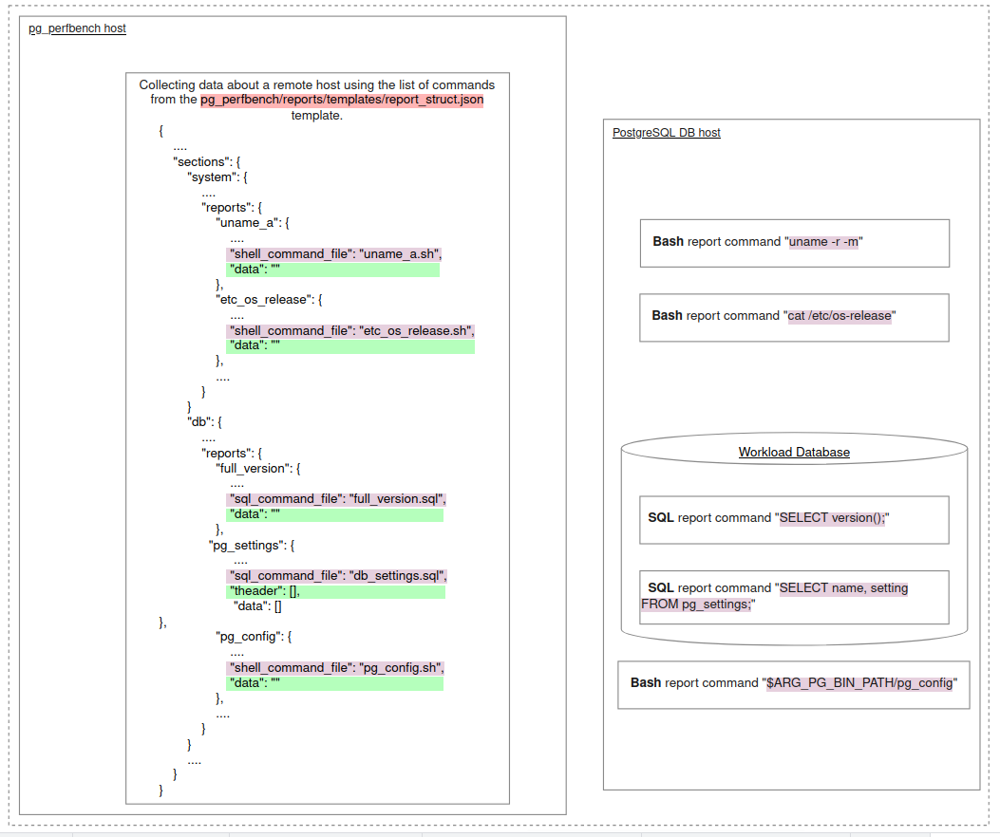
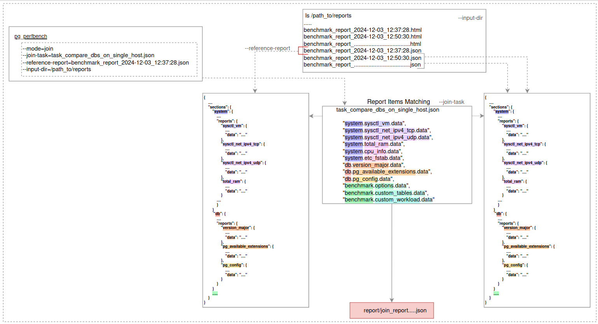

# Generating report in `benchmark` mode
You can configure the JSON report template file `pg_perfbench/reports/templates/report_struct.json`.
Add or remove reports of the following types:

- "shell_command_file" - a report with the result of executing the specified bash script relative to the database host in the `pg_perfbench/commands/bash_commands` directory:

&emsp; &emsp;- output type `plain_text`:

```
"example_bash_report": {
  "header": "example_bash_header",
  "state": "collapsed",
  "item_type": "plain_text",
  "shell_command_file": "bash_example.sh",
  "data": ""
}
```

&emsp; &emsp;- output type `table`:

> **Note**: this bash script should return data in the form of an array of objects on the basis of which the table is built, as an example you can see the output of lshw in the report pg_perfbench/reports/templates/report_struct.json
```
"example_bash_report": {
  "header": "example_bash_header",
  "state": "collapsed",
  "item_type": "table",
  "shell_command_file": "bash_example.sh", <----- 
  "theader": [],
  "data": []
}
```
- "sql_command_file" - a report with the result of executing the specified SQL script in the database located in the `pg_perfbench/commands/sql_commands` directory, for example:

&emsp; &emsp;- output type `plain_text`:
```
"example_sql_report": {
    "header": "example_sql_header",
    "state": "collapsed",
    "item_type": "plain_text",
    "sql_command_file": "sql_example.sql",
    "data": ""
}
```
&emsp; &emsp;- output type `table`:
> **Note**: This sql script should return a tabular form of the data. Examples can be found in pg_perfbench/reports/templates/report_struct.json
```
"example_bash_report": {
  "header": "example_bash_header",
  "state": "collapsed",
  "item_type": "table",
  "shell_command_file": "sql_example.sql", <----- 
  "theader": [],
  "data": []
}
```
### Logic of Report Information Collection



# Generating report in `join` mode
In this mode, single workload reports can be compared based on selected categories, which can be configured manually.

#### Join mode options
| Option                     | Description                                               |
|----------------------------|-----------------------------------------------------------|
| `--join-task`              | Criteria for comparing reports                            |
| `--reference-report`       | Criteria for comparing reports                            |
| `--input-dir`              | Reports directory                                         |


#### Example Configuration
```bash
python3.11 -m pg_perfbench --mode=join \
--join-task=task_compare_dbs_on_single_host.json \
--reference-report=benchmark_report_2024-12-03_12:37:28.json \
--input-dir=/path_to/reports
```

In the example above:
 - **pg_perfbench** compares reports located in the directory `--input-dir=/path_to/reports`.
 - The reference comparison report can be set using the `--reference-report` argument, by default the first one alphabetically is used.
 - `--join-task` - comparison fields that must match between the compared reports, can be configured manually in ***.json** format according to the schema:

 ```bash
 {
     "description": "......",
     "items": [
         "section.report.data",
         "section.report.data",
         "section.report.data",
         ........
     ]
 }
```
- The final comparison report `join_report.json` is saved `report` directory.


