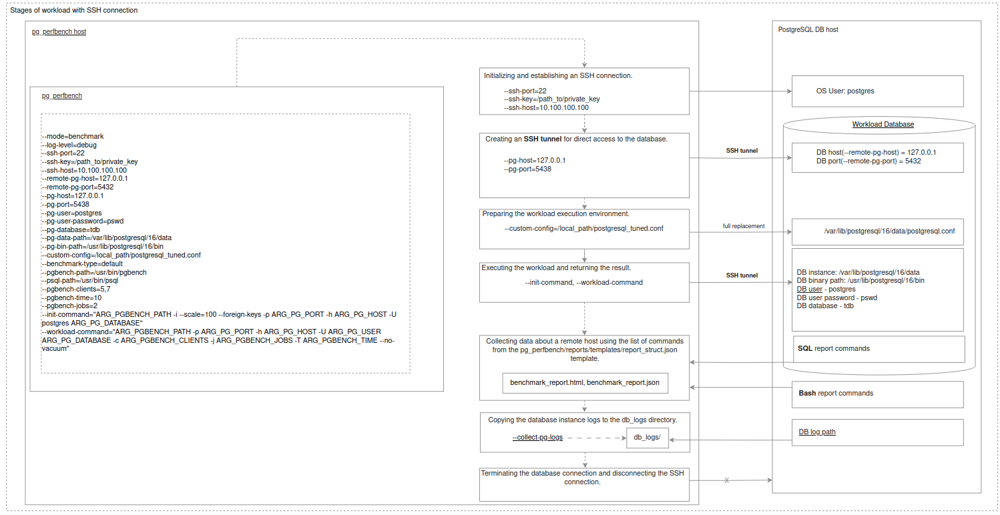

# PostgreSQL Performance Bench
## Testing a PostgreSQL database instance located on a remote host

#### General environment preparation 
The dependencies and installation instructions for the application are described on the main README [page](../README.md#dependencies-and-installation).

#### Environment preparation for SSH connection
The SSH setup steps are described in more detail in the [README](../README.md#connection-options).<br>
Here is a list of steps for configuring a loadable remote database host over an SSH connection:
```bash
# ========================================
# Actions on the pg_perfbench host
# ========================================

# Create an ssh key at the path you specify 
mkdir -p path/to/your/postgres_keys/.ssh
ssh-keygen -t rsa -b 4096 -C "postgres" -f postgres_keys/.ssh/id_rsa
 
ls postgres_keys/.ssh
>>
    id_rsa  id_rsa.pub
 
 
chmod 700 postgres_keys/.ssh
chmod 644 postgres_keys/.ssh/id_rsa.pub
chmod 600 postgres_keys/.ssh/id_rsa 
 
scp postgres_keys/.ssh/id_rsa.pub <user>@<database_server_address>:/tmp

# ========================================
# Actions on the data base server
# ========================================
cat >> /etc/ssh/sshd_config << EOL
PubkeyAcceptedKeyTypes=+ssh-rsa
EOL
systemctl restart sshd
 
mkdir /var/lib/postgresql/.ssh
cat /tmp/id_rsa.pub >> /var/lib/postgresql/.ssh/authorized_keys
chmod 700 /var/lib/postgresql/.ssh
chown -R postgres:postgres /var/lib/postgresql/.ssh

sudo visudo
>>>
# Add the following line to grant the `postgres` user permission to drop caches
postgres ALL=(ALL) NOPASSWD: /usr/bin/tee /proc/sys/vm/drop_caches
# To allow the `postgres` user to execute `lshw` without a password, add the following privileges
postgres ALL=(root) NOPASSWD: /usr/bin/lshw

# To archive the instance logs, install tar(Ubuntu example) on the data base server
sudo apt update
sudo apt install tar

# Allow the client to pass locale and custom environment variables
# Open the SSH server configuration file
sudo nano /etc/ssh/sshd_config
>>>
AcceptEnv LANG LC_* ARG_* # Locate or add the following line (append ARG_* at the end if it's not already present)

# Save the file and restart the SSH daemon to apply changes
sudo systemctl restart sshd

```
### Database configuration on the load host:
PostgreSQL must be pre-installed on the load host (from any installation source):
```bash
apt install postgresql
```
The cluster must be initialized in advance:
```bash
initdb -D data_dir
```
### Application configuration for remote access to the database via an SSH connection

It is strongly recommended to use local address forwarding for minimal database configuration:
```bash
<local_port>:127.0.0.1:<remote_port>
```
#### Simple test configuration of a PostgreSQL database instance located on a remote host 

- `pg_perfbench`  is executed as a module:
```
python -m pg_perfbench <args>
```
Database configuration on the load host:
PostgreSQL must be pre-installed on the load host (from any installation source).
apt install postgresql
The cluster must be initialized in advance:
initdb -D data_dir

- Application operating mode {benchmark, join}:
```
--mode=benchmark
```

- Configure SSH connection usage parameters:
```
--ssh-port=22 
--ssh-key=/path_to/private_key
--ssh-host=10.100.100.100
--remote-pg-host=127.0.0.1 
--remote-pg-port=5432 
--pg-host=127.0.0.1 
--pg-port=5438 
```
> **Note**: `--pg-port, --pg-host` - Parameters of the local address used for forwarding to the listening address of the database instance on a remote host (via SSH tunnel), specified by `--remote-pg-port, --remote-pg-host`. The specified address for `--pg-port, --pg-host` must be accessible by `pg_perfbench`.


- Logging level for output of application execution stages [`info`,`debug`,`error`]:
```
--log-level=debug
```
- Database instance parameters:
```
--pg-user=postgres
--pg-user-password=pswd
--pg-database=tdb
--pg-data-path=/var/lib/postgresql/data
--pg-bin-path=/usr/lib/postgresql/16/bin
```

- pgbench workload environment parameters:
```
--benchmark-type=default
--psql-path=/usr/bin/psql
--pgbench-path=/usr/bin/pgbench
--init-command="ARG_PGBENCH_PATH -i --scale=100 --foreign-keys -p ARG_PG_PORT -h ARG_PG_HOST -U postgres ARG_PG_DATABASE" 
--workload-command="ARG_PGBENCH_PATH -p ARG_PG_PORT -h ARG_PG_HOST -U ARG_PG_USER ARG_PG_DATABASE -c ARG_PGBENCH_CLIENTS -j 3 -T 10 --no-vacuum"
```
- You can also specify arguments used as placeholders in command strings `--init-command`,  `--workload-command`(see more [workload description](workload_description.md#how-to-configure-workload)):
  - `--pg-host` will be resolved as `ARG_PG_HOST`.
  - `--pgbench-clients` will be resolved as `ARG_PGBENCH_CLIENTS`.

- Final set of arguments for database workload over an SSH connection on a remote host:
```
python -m pg_perfbench --mode=benchmark  \
--log-level=debug  \
--ssh-port=22  \
--ssh-key=/path_to/private_key \
--ssh-host=10.100.100.100  \
--remote-pg-host=127.0.0.1  \
--remote-pg-port=5432  \
--pg-host=127.0.0.1  \
--pg-port=5438  \
--pg-user=postgres  \
--pg-user-password=pswd  \
--pg-database=tdb  \
--pg-data-path=/var/lib/postgresql/16/data  \
--pg-bin-path=/usr/lib/postgresql/16/bin  \
--benchmark-type=default \
--pgbench-path=/usr/bin/pgbench \
--psql-path=/usr/bin/psql  \
--pgbench-clients=5,7 \
--init-command="ARG_PGBENCH_PATH -i --scale=100 --foreign-keys -p ARG_PG_PORT -h ARG_PG_HOST -U postgres ARG_PG_DATABASE"  \
--workload-command="ARG_PGBENCH_PATH -p ARG_PG_PORT -h ARG_PG_HOST -U ARG_PG_USER ARG_PG_DATABASE -c ARG_PGBENCH_CLIENTS -j 3 -T 10 --no-vacuum"
```
Initial application log output with correct configuration:
```
2024-11-27 21:28:09,433       INFO                                root :   37 - Logging level: debug
2024-11-27 21:28:09,433       INFO      pg_perfbench.benchmark_running :   26 - Version - 0.0.1
2024-11-27 21:28:09,434       INFO      pg_perfbench.benchmark_running :   27 - Started MainRoutine.run
2024-11-27 21:28:09,434       INFO      pg_perfbench.benchmark_running :   35 - Incoming parameters:
#   clear_logs = False
#   log_level = debug
#   mode = benchmark
#   collect_pg_logs = True
#   benchmark_type = default
#   pgbench_clients = [5, 7]
#   init_command = ARG_PGBENCH_PATH -i --scale=100 --foreign-keys -p ARG_PG_PORT -h ARG_PG_HOST -U postgres ARG_PG_DATABASE
#   workload_command = ARG_PGBENCH_PATH -p ARG_PG_PORT -h ARG_PG_HOST -U ARG_PG_USER ARG_PG_DATABASE -c ARG_PGBENCH_CLIENTS -j 3 -T 10 --no-vacuum
#   pgbench_path = /usr/bin/pgbench
#   psql_path = /usr/bin/psql
#   custom_config = 
#   pg_host = 127.0.0.1
#   pg_port = 5438
#   pg_user = postgres
#   pg_user_password = ****
#   pg_database = tdb
#   pg_data_path = /var/lib/postgresql/16/data
#   pg_bin_path = /usr/lib/postgresql/16/bin
#   ssh_host = 10.100.100.100
#   ssh_port = 22
#   ssh_key = *********************************************************************************
#   remote_pg_host = 127.0.0.1
#   remote_pg_port = 5432
#-----------------------------------
2024-11-27 21:28:09,434       INFO                                root :   15 - Database connection type - SSH
2024-11-27 21:28:09,434       INFO                                root :   77 - Template report_struct.json is configured correctly
2024-11-27 21:28:09,434       INFO        pg_perfbench.connections.ssh :   42 - Attempting to establish an SSH connection: 
2024-11-27 21:28:10,440       INFO        pg_perfbench.connections.ssh :   76 - SSH connection established.
2024-11-27 21:28:10,440       INFO      pg_perfbench.benchmark_running :   64 - Start benchmarking
2024-11-27 21:28:10,441       INFO      pg_perfbench.benchmark_running :   68 - Current benchmark iteration: /usr/bin/pgbench -p 5438 -h 127.0.0.1 -U postgres tdb -c 5 -j 3 -T 10 --no-vacuum
2024-11-27 21:28:10,441      DEBUG      pg_perfbench.benchmark_running :   44 - Benchmark preparation
2024-11-27 21:28:10,692       INFO        pg_perfbench.connections.ssh :   94 - 
2024-11-27 21:28:10,750       INFO        pg_perfbench.connections.ssh :   94 - 
2024-11-27 21:28:10,799       INFO        pg_perfbench.connections.ssh :   94 - sudo: a terminal is required to read the password; either use the -S option to read from standard input or configure an askpass helper
sudo: a password is required

Database is available.
2024-11-27 21:28:11,979       INFO          pg_perfbench.operations.db :   46 - Terminating other sessions to the test DB
2024-11-27 21:28:11,998       INFO          pg_perfbench.operations.db :   48 - Dropping test DB
2024-11-27 21:28:12,040       INFO          pg_perfbench.operations.db :   50 - Creating pristine test DB
2024-11-27 21:28:12,165       INFO      pg_perfbench.benchmark_running :   49 - Create a database schema. Response: /usr/bin/pgbench -i --scale=100 --foreign-keys -p 5438 -h 127.0.0.1 -U postgres tdb
2024-11-27 21:28:56,973      DEBUG      pg_perfbench.benchmark_running :   51 - Result:
 
2024-11-27 21:28:56,974      DEBUG      pg_perfbench.benchmark_running :   52 - Running performance test: /usr/bin/pgbench -p 5438 -h 127.0.0.1 -U postgres tdb -c 5 -j 3 -T 10 --no-vacuum

```
### General scheme of workload stages at SSH connection

