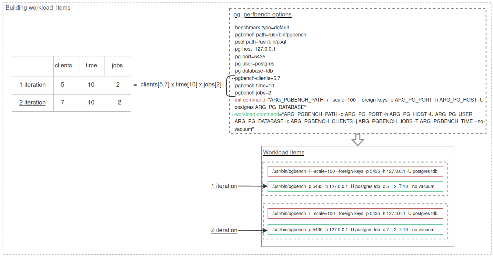
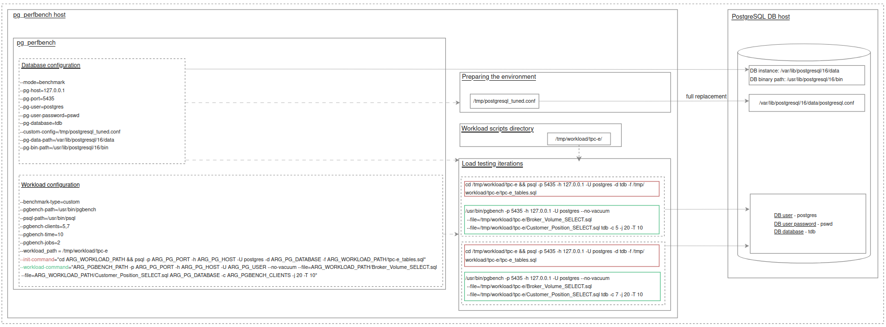

## **Application load test pg_perfbench configuration options:**

#### PostgreSQL Database Environment Options
| Argument                  | Description                                                                                                   |
|---------------------------|---------------------------------------------------------------------------------------------------------------|
| `--pg-host`               | Specify the PostgreSQL host.                                                                                 |
| `--pg-port`               | Specify the PostgreSQL port.                                                                                 |
| `--pg-user`               | Specify the PostgreSQL username.                                                                             |
| `--pg-user-password`      | Specify the PostgreSQL user password.                                                                        |
| `--pg-database`           | Specify the PostgreSQL database name.                                                                        |
| `--pg-data-path`          | Specify the PostgreSQL data directory.                                                                       |
| `--pg-bin-path`           | Specify the PostgreSQL binaries directory.                                                                   |
| `--custom-config`         | Specify the PostgreSQL custom configuration file path.                                                       |

#### Workload Options
| Argument                  | Description                                                                                                   |
|---------------------------|---------------------------------------------------------------------------------------------------------------|
| `--benchmark-type`        | Benchmark type (`custom` or `default`).                                                                      |
| `--collect-pg-logs`       | DB log collection mode. Note that the database instance log directory is queried using the command `SHOW log_directory;`. |
| `--workload-path`         | Path to the workload directory.                                                                              |
| `--pgbench-clients`       | `pgbench` benchmarking argument: `--clients`.                                                                |
| `--pgbench-jobs`          | `pgbench` benchmarking argument: `--jobs`.                                                                   |
| `--pgbench-time`          | `pgbench` benchmarking argument: `--time`.                                                                   |
| `--init-command`          | Database initialization command in the terminal.                                                             |
| `--workload-command`      | Database workload command in the terminal.                                                                   |
| `--pgbench-path`          | Specify the `pgbench` path (relative to the current host).                                                    |
| `--psql-path`             | Specify the `psql` path (relative to the current host).                                                      |


## **How to configure workload**
#### **PostgreSQL Database Environment Configuration:**
- A pre-initialized PostgreSQL instance is used.
- `--pg-host`,`--pg-port` - Local forwarding address to the remote database.
- `--pg-database` - The database is recreated between workload items.
- `--pg-user` - A postgres superuser is required to run the workload.
- `--pg-user-password` - Optional parameter, preferably set trust authentication type in pg_hba.conf.
-  `--pg-bin-path` - Database utility directory on the database host.
-  `--pg-data-path`- Data catalog of the load database instance.
-  `--custom-config` - The specified configuration file is installed instead of the pre-installed postgresql.conf.

#### **Workload Configuration:**
- The item of workload is PostgreSQL user utilities: **pgbench**, **psql**. 
- `--init-command`, `--workload-command` - Сommands forming a workload item. Command arguments are specified using **placeholders** in the workload configuration strings.
- `--benchmark-type` - The **custom** benchmark involves accessing workload scripts within the `--init-command`, `-workload-command` commands.
- **Placeholders** can only be defined from the built-in arguments of **pg_perfbench** related to **database** and **workload** environment configuration. For example:
  - `--pg-host` will be resolved as `ARG_PG_HOST`.
  - `--pgbench-clients` will be resolved as `ARG_PGBENCH_CLIENTS`.
 
- **The number of workload items** is determined by the arrays `--pgbench-clients`, `--pgbench-jobs`, and `--pgbench-time`, which form combinations of a **Cartesian product**.
  Therefore, you should carefully populate these parameters to avoid unnecessary workload items.
  

#### **Final Command Strings:**
- **Initialization Command:**
  ```bash
  --init-command="ARG_PGBENCH_PATH -i --scale=100 --foreign-keys -p ARG_PG_PORT -h ARG_PG_HOST -U postgres ARG_PG_DATABASE"
  ```
- **Workload Command:**
  ```bash
  --workload-command="ARG_PGBENCH_PATH -p ARG_PG_PORT -h ARG_PG_HOST -U ARG_PG_USER ARG_PG_DATABASE -c ARG_PGBENCH_CLIENTS -j ARG_PGBENCH_JOBS -T ARG_PGBENCH_TIME --no-vacuum"
  ```


### **Default workload diagram**


### **Custom workload diagram**

